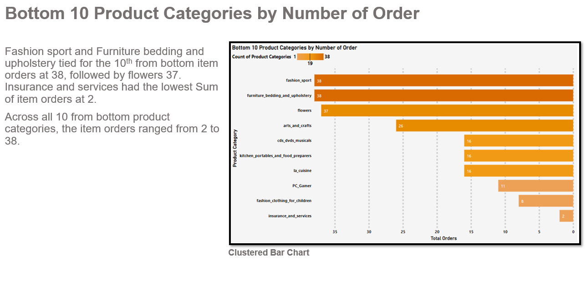

# Brazilian_E-Store
### Olist is a Brazilian e-commerce platform that connects small and medium-sized businesses to customers across Brazil. The platform operates as a marketplace, where merchants can list their products and services and customers can browse and purchase them online. The Olist dataset is from 2016-2018. 

 

### In this report I will analyse: 
<li>Total Payment Value by Year and Month: (Line Chart)
<li>Top 10 Customer States by Number of Orders Delivered: (Map Chart)
<li>Bottom 10 Customer States by Number of Orders Delivered: (Map Chart)
<li>Top 10 Product Categories by Number of Order: (Clustered Bar Chart)
<li>Bottom 10 Product Categories by Number of Order: (Clustered Bar Chart)
<li>Number of Orders delivered On time, Early and Late : (Histogram Chart)

### Software used:
Google sheets: To translate the products from Portuguese to English in one of the multiple Olist Datasets.   
Microsoft Power BI: Created six visualizations to produce a report to explain the different insights from the data. Dax formulas used to combine columns to fix an error with the map chart location. To get the difference from the delivery estimated date and delivery date, next to group the days from the difference and to sort out the order of the histogram. 
  
 

 

 

 

 

 

## Summary
  
### Improvements:  
The payment value from 2016 – 2018 has mostly gone in an upward trend. The last two months of recorded data (September and October 2018) had a very steep decline. Ways to improve this is updating overall advertisement every quarter during the year, to keep the attention of current customers and attract new customers. 

Bottom 10 Customer States by Number of Orders Delivered, these states can do targeted advertisement to better attract more customers or find out the types of products that are more useful to the customers from these states.  

Bottom 10 Product Categories by Number of Order the lowest was Insurance and services and fashion clothing for children. Restructure the insurance and services plan and process when applying for this service to make it more appealing and straight forward for users. Hire new and more fashion designers that specialise particularly in children’s fashion this will generate more ideas to improve this type of clothing.

Number of Orders delivered On time, Early and Late, between 1-10 (-10-0, 8.54%) days late delivery; or on the exact day that was the estimated delivery date. This is (0) days, (-10-0) section within the histogram chart. Decrease lateness percentages, by making the delivery process smoother and fix any errors within the delivery system as quickly as possible to increase better delivery times.  

