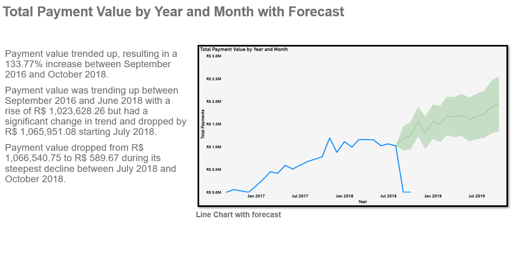

# Brazilian_E-Store
### Olist is a Brazilian e-commerce platform that connects small and medium-sized businesses to customers across Brazil. The platform operates as a marketplace, where merchants can list their products and services and customers can browse and purchase them online. The Olist dataset is from 2016-2018. 

 

In this report I will analyse the data of pizza orders.

### I will mention: 
Total Payment Value by Year and Month: (Line Chart)
Top 10 Customer States by Number of Orders Delivered: (Map Chart)
Bottom 10 Customer States by Number of Orders Delivered: (Map Chart)
Top 10 Product Categories by Number of Order: (Clustered Bar Chart)
Bottom 10 Product Categories by Number of Order: (Clustered Bar Chart)
Number of Orders delivered On time, Early and Late : (Histogram Chart)

### Software used:
Google sheets: To translate the products from Portuguese to English in one of the multiple Olist Datasets.   
Microsoft Power BI: Created six visualizations to produce a report to explain the different insights from the data. Dax formulas used to combine columns to fix an error with the map chart location. To get the difference from the delivery estimated date and delivery date, next to group the days from the difference and to sort out the order of the histogram. 
  
 

 

 

 

 

 
